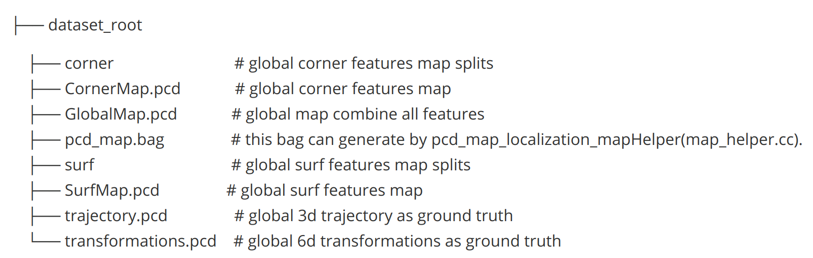

# pcd-map-localization
Localization based on prior point cloud map saved by lio_sam or other methods meanwhile calibrate Lidar and IMU extrinsics meanwhile.

# Dependencies
Test in ubuntu 20.04 ros noetic

[ROS install tutorial](https://www.ros.org/blog/getting-started/)

# Datasets

Datasets is pcd point cloud as follow which generated by [lio-sam-noted](https://github.com/stu-fullstack/lio-sam-noted) which  fork from [LIO-SAM](https://github.com/TixiaoShan/LIO-SAM).

NOTE: we modified pcd map save function of lio-sam-noted to save split corner and surf features.



The bag file can generate by run(map_helper.cc) :

```shell
rosrun pcd_map_localization pcd_map_localization_mapHelper
```

# Build

```shell
# cd catkin workspace in your env
cd ~/catkin_ws
# Just run catkin_make or some other config you want
catkin_make
```

# example

## localization

```shell
roslaunch pcd_map_localization run.launch
```

## calibration


